# Тестовое задание для Smart Collect - REST-сервис для управления заявками на выплату средств
* Содержание задания в файле "Backend Developer - Test Task.pdf"

## Запуск проекта (используется poetry совместно с makefile)
### Команды для локального запуска:
* ~ make install        - устанавливает venv и зависимости через poetry
* ~ make venv           - запуск окружения (лучше интегрировать его в настройках интерпритатора)
* Редактируем .env для собственных настроек (в частности PostgreSQL)
* запускаем PostgreSQL
* Запускаем Redis в Ubuntu
* Запускаем дополнительный терминал для Celery
* ~ celery -A SmartCollect_task worker -l info  - Запускаем Calary в соседнем терминале
* Возвращаемся в изначальный терминал
* ~ make migrate   - Собираем и запускаем миграции
* ~ make format    - Проверяем и правим код форматером (black)
* ~ make lint      - Проверяем качество кода линтером (pylint)
* ~ make test      - Запускаем тесты для проверки целостности кода
* ~ make run       - Запускаем проект (на http://127.0.0.1:8000/api/docs/ ,будет доступна документация Swagger)

### Команды для запуска в docker
* ~ make docker-build    - Билдим образы в докере
* ~ make docker-up       - Запускаем образы в докере (на http://local:8000/api/docs/ ,будет доступна документация Swagger)

### Дополнительные доступные возможности Makefile можно посмотреть командой:
* ~ make help

## Примеры работы с API из докера
### Создание новой заявки в Postman
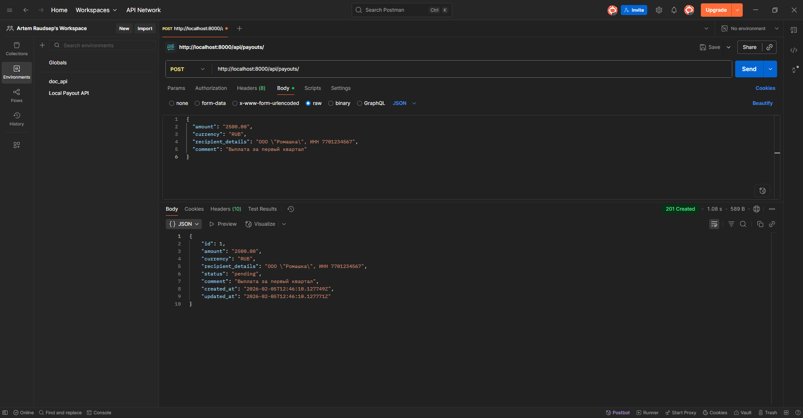
### Создание новой заявки в Swagger
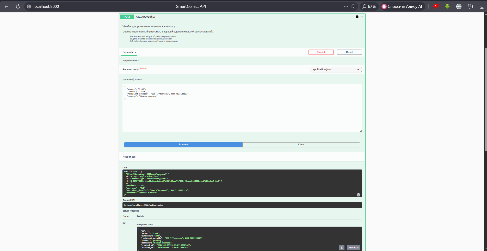
### Просмотр всех заявок в Postman
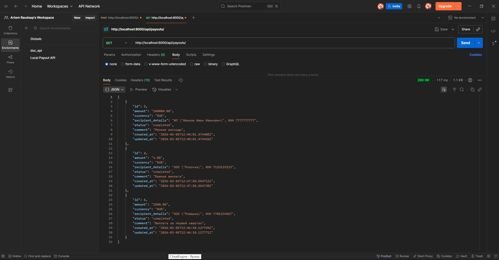
### Просмотр конкретной заявки по id в Postman
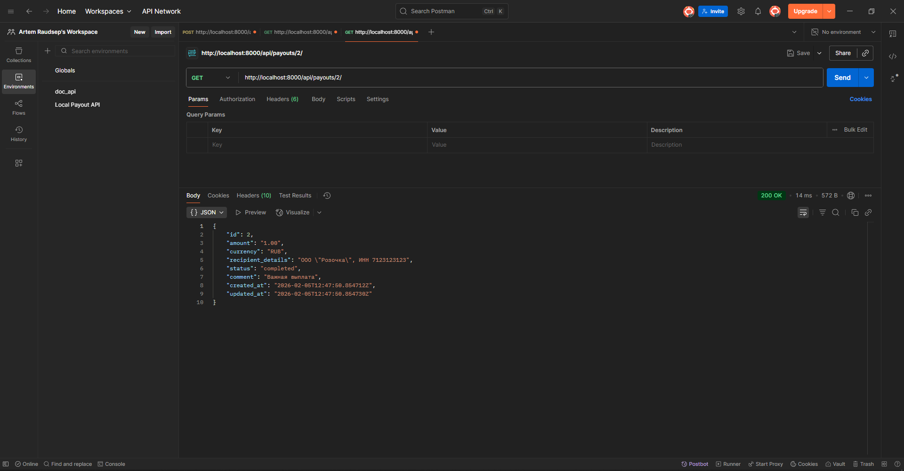
### Просмотр конкретной заявки по id в Swagger
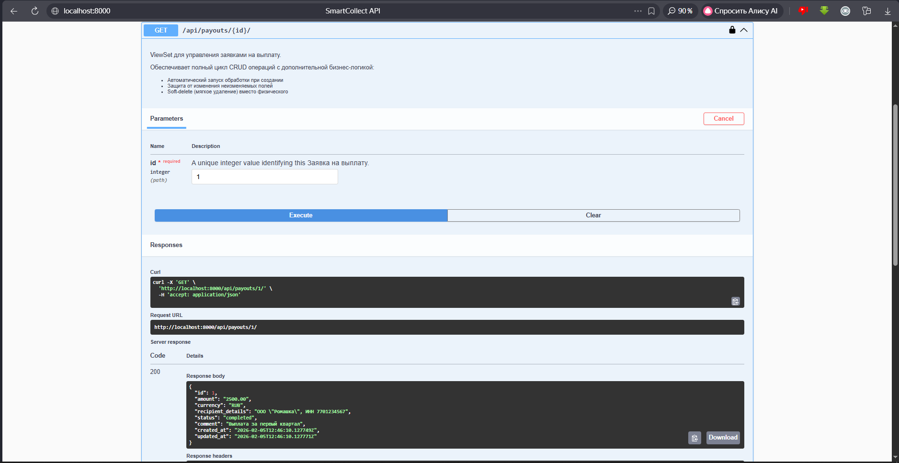
### Редактирование заявки в Swagger
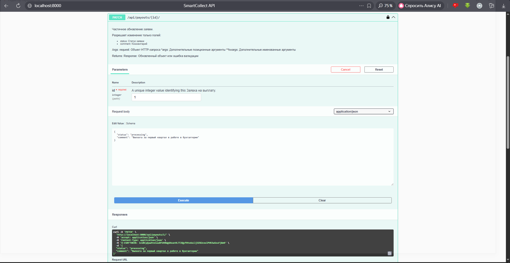
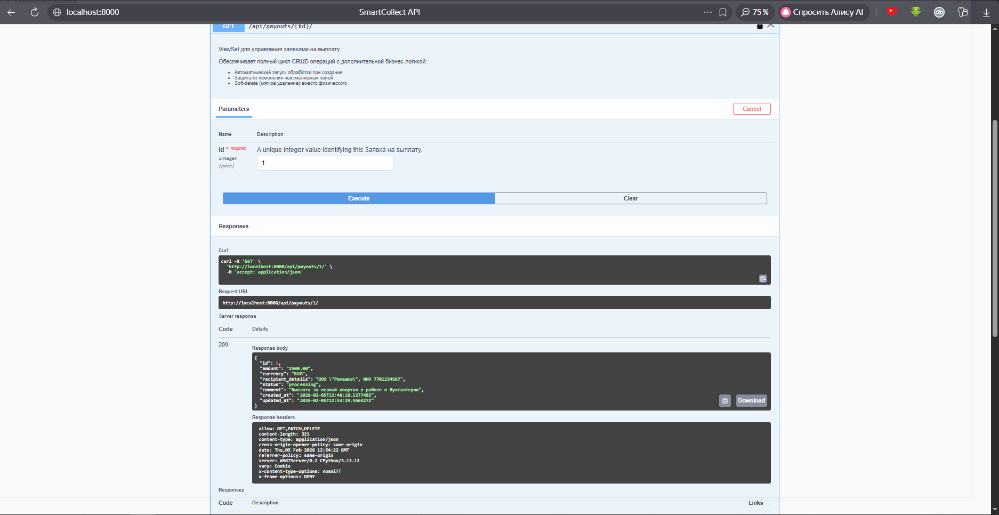
### Подключение к Django shell на докере и просмотр результата работы Celery
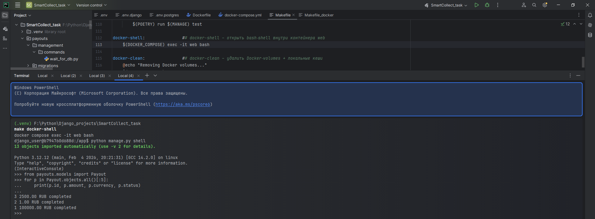
### Удаление заявок (soft-delete) с процессом (Postman/Swagger)
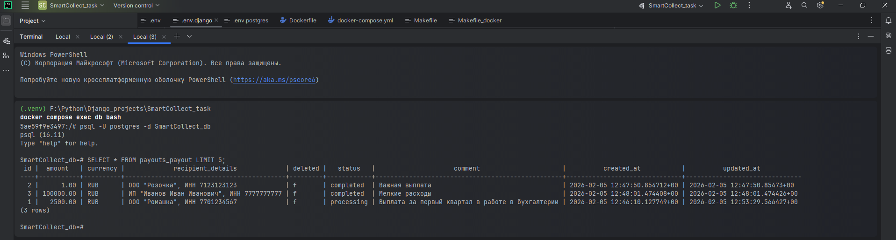
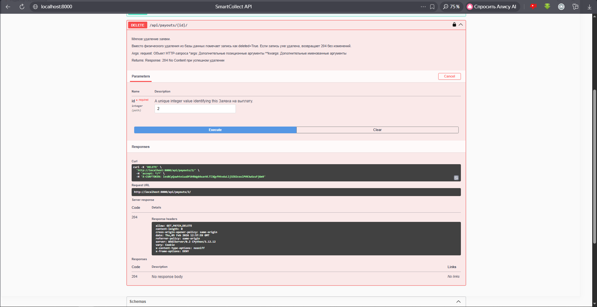
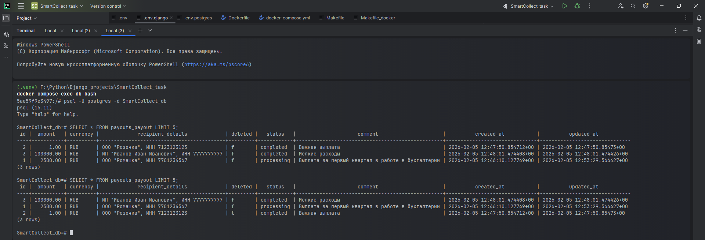
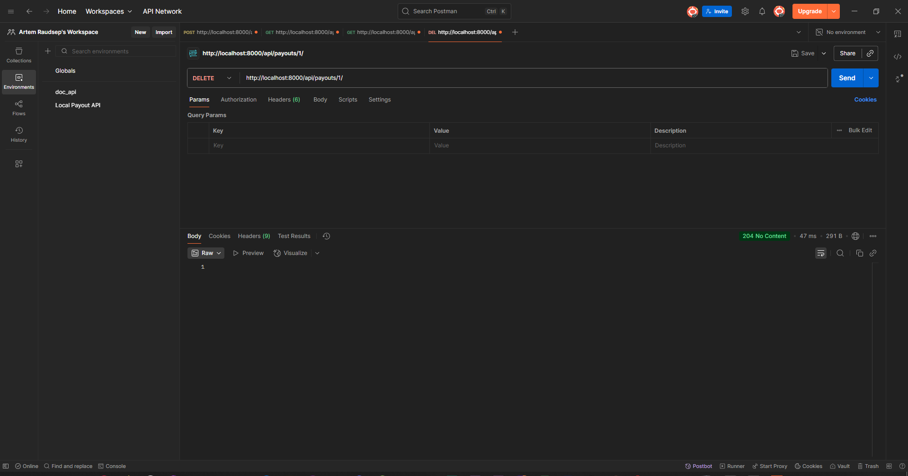
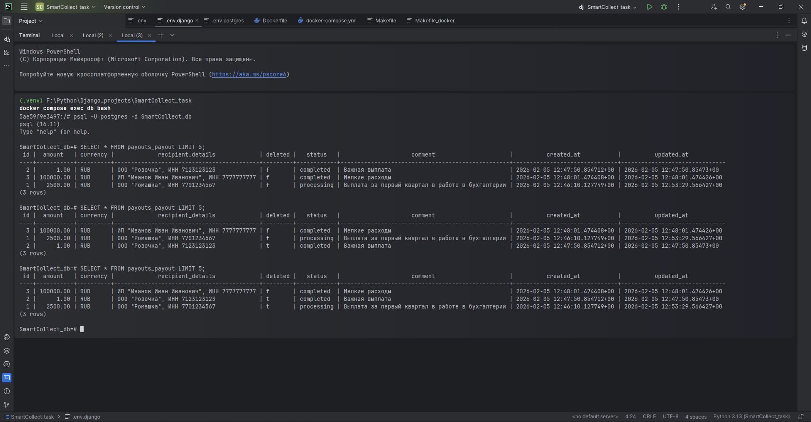

## Пример выполненных линтера, форматера и тестов

## Деплой на сервер
* У меня есть полная инструкция по настройке сервера и деплою проекта через GitLab, которую я писал сам в процессе изучения и создания одного из проектов. Она представлена в файле Ubuntu.txt 
### Но если кратко:
* Настраиваем сервера, создаем SSH
* Устанавливаем git, docker и всё необходимое
* Подключаемся к GitLab и настраиваем раннер
* Клонируем репозиторий, билдим докер (он запустит БД, Redis, Celery и сам проект)
